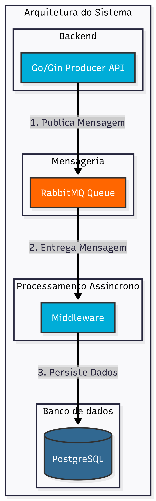

# Telemetria Industrial - Go + RabbitMQ + PostgreSQL

Projeto simples com arquitetura desacoplada para ingestão de telemetria:

1. A API (`POST /telemetry`) recebe os dados dos dispositivos.
2. A API publica a mensagem no RabbitMQ (`telemetry_queue`).
3. O middleware consome da fila e persiste no PostgreSQL.

## Arquitetura



Fluxo principal:

1. Cliente envia telemetria para a API.
2. API valida e enfileira a mensagem.
3. Middleware processa de forma assincrona.
4. Banco recebe os registros consolidados.

## Arquitetura e decisões de design

A solução segue um padrão producer-consumer assíncrono para desacoplar a ingestão de dados do processamento:

- API (Producer HTTP)

Recebe dados de dispositivos IoT, valida cada payload de telemetria, publica a mensagem no RabbitMQ e retorna `202 Accepted` imediatamente sem aguardar persistência. Isto permite latência baixa mesmo quando o banco está sobrecarregado.

- RabbitMQ (Fila de mensagens)

Funciona como amortecedor de carga entre API e banco de dados. A fila `telemetry_queue` é durável e sobrevive reinícios. Quando a API publica, a mensagem fica enfileirada para que o middleware consuma a seu próprio ritmo. Se o middleware cair, mensagens não são perdidas; se a API receber pico de carga, RabbitMQ acumula mensagens para processamento posterior.

- Middleware (Consumer + Persistidor)

Processa mensagens de forma assíncrona e garante persistência atomicamente. Consome da fila com `QoS=50` (limite de 50 em processamento simultâneo), valida cada JSON e insere no PostgreSQL, confirmando (`ack`) somente após sucesso. Se falhar, rejeita com requeue, retornando a mensagem à fila para retry automático.

- PostgreSQL (Persistência)

Armazena telemetria de forma durável para consultas analíticas posteriores. A tabela `telemetry` possui schema otimizado para ingestão e leitura rápida, com índice em `(device_id, event_time DESC)` que permite queries eficientes por dispositivo e intervalo temporal.

## Stack

- Go (API e Middleware)
- Gin (HTTP)
- RabbitMQ (mensageria)
- PostgreSQL (persistencia)
- Docker Compose (orquestração)
- k6 (teste de carga)

## Estrutura

- `api/main.go`: produtor HTTP -> RabbitMQ
- `middleware/main.go`: consumidor RabbitMQ -> PostgreSQL
- `db/init.sql`: schema da tabela `telemetry`
- `docker-compose.yml`: sobe toda a infraestrutura
- `stress_test/telemetry.js`: script de carga k6

### Schema da tabela `telemetry`

```sql
CREATE TABLE telemetry (
    id BIGINT GENERATED BY DEFAULT AS IDENTITY PRIMARY KEY,
    device_id BIGINT NOT NULL,
    event_time TIMESTAMPTZ NOT NULL,
    sensor_type VARCHAR(100) NOT NULL,
    reading_type VARCHAR(20) NOT NULL,
    value DOUBLE PRECISION NOT NULL,
    captured_at TIMESTAMPTZ NOT NULL DEFAULT NOW(),
    created_at TIMESTAMPTZ NOT NULL DEFAULT NOW()
);

CREATE INDEX idx_telemetry_device_time
ON telemetry (device_id, event_time DESC);
```

**Colunas:**

- `id`: identificador único auto-gerado.
- `device_id`: identificador do dispositivo que enviou a telemetria.
- `event_time`: timestamp do evento no dispositivo.
- `sensor_type`: tipo de sensor (ex: temperatura, umidade).
- `reading_type`: tipo de leitura (analogica ou discreta).
- `value`: valor lido pelo sensor.
- `captured_at`: timestamp quando a mensagem foi capturada na API.
- `created_at`: timestamp quando o registro foi inserido no banco.

**Índice:**

O índice `idx_telemetry_device_time` otimiza buscas por dispositivo e intervalo de tempo, típicas em queries analíticas.

## Como executar

```bash
docker compose up --build
```

Serviços:

- API: `http://localhost:8080`
- RabbitMQ Management: `http://localhost:15672` (guest/guest)
- PostgreSQL: `localhost:5432` (postgres/postgres)

## Health check

```bash
curl http://localhost:8080/health
```

## Enviar telemetria

```bash
curl -X POST http://localhost:8080/telemetry \
	-H "Content-Type: application/json" \
	-d '{
		"device_id": 1001,
		"timestamp": "2026-03-22T12:00:00Z",
		"sensor_type": "temperatura",
		"reading_type": "analogica",
		"value": 27.4
	}'
```

Resposta esperada:

```json
{"status":"queued"}
```

## Tipos de leitura suportados

- `analogica` (ex: temperatura, umidade, luminosidade)
- `discreta` (ex: ligado/desligado, aberto/fechado, presenca/ausencia)

## Teste de carga com k6

O script em `stress_test/telemetry.js` está configurado para load test de taxa constante:

- Executor: `constant-arrival-rate`
- Taxa alvo: `100 req/s`
- Duração: `1m`
- `preAllocatedVUs`: `500`
- `maxVUs`: `10000`

Execução:

```bash
k6 run stress_test/telemetry.js
```

## Resultado de carga (k6)

O script `stress_test/telemetry.js` foi testado em dois cenários para avaliar comportamento sob diferentes volumetrias.

### Cenário 1: 100 req/s (6000 requisições em 60s)

Simula uma carga moderada típica de sistemas em operação normal.

**Configuração:**
- Taxa: `100 iterações/s`
- Duração: `1m`
- VUs pré-alocadas: `500`
- Máximo de VUs: `10000`

**Resultados:**

| Métrica | Valor |
|---------|-------|
| Requisições totais | 6000 |
| Taxa efetiva | 99.99 req/s |
| Sucesso (status 202) | 100% (6000/6000) |
| Falhas HTTP | 0% (0/6000) |
| Latência média | 1.00 ms |
| Latência p95 | 1.28 ms |
| Latência máxima | 3.36 ms |
| Dados enviados | 1.5 MB |
| Dados recebidos | 888 kB |

**Thresholds:** ✓ Aprovados

### Cenário 2: 250 req/s (15001 requisições em 60s)

Simula uma carga elevada, cenário de pico de utilização.

**Configuração:**
- Taxa: `250 iterações/s`
- Duração: `1m`
- VUs pré-alocadas: `500`
- Máximo de VUs: `10000`

**Resultados:**

| Métrica | Valor |
|---------|-------|
| Requisições totais | 15001 |
| Taxa efetiva | 250.00 req/s |
| Sucesso (status 202) | 100% (15001/15001) |
| Falhas HTTP | 0% (0/15001) |
| Latência média | 0.79 ms |
| Latência p95 | 1.06 ms |
| Latência máxima | 5.65 ms |
| Dados enviados | 3.8 MB |
| Dados recebidos | 2.2 MB |

**Thresholds:** ✓ Aprovados

### Análise comparativa

- **Escalabilidade:** O sistema mantém latência baixa e zero falhas mesmo sob carga 2.5x maior (100 vs 250 req/s).
- **Latência:** Reduz levemente sob carga mais alta (1.00 ms → 0.79 ms média), indicando aproveitamento eficiente de recursos.
- **Resiliência:** Nenhuma falha em ambos cenários; o desacoplamento via RabbitMQ funciona bem como amortecedor.
- **Thresholds:** Ambos cenários passam nos limites (`p(95) < 500ms` e taxa de falha `< 1%`), comprovando confiabilidade.

## Atividade Ponderada 2 - Integracao com Raspberry Pi Pico W (Arduino)

Esta secao descreve o firmware embarcado em `firmware/firmware.ino`, que envia telemetria para o mesmo endpoint da Atividade 1.

### Framework e toolchain

- Framework: Arduino (core para Raspberry Pi Pico W)
- Linguagem: C/C++ (Arduino)
- Bibliotecas principais: `WiFi.h`, `HTTPClient.h`, `WiFiUdp.h`, `NTPClient.h`
- Placa alvo: Raspberry Pi Pico W

### Sensores integrados e pinos

| Sensor | Tipo de leitura | Pino Pico W | Faixa esperada | Conversao enviada |
|---|---|---|---|---|
| Push button (contato) | Discreta | GPIO 15 | `0` (pressionado) / `1` (solto, `INPUT_PULLUP`) | `value` 1.0 para pressionado e 0.0 para solto |
| LDR (divisor resistivo) | Analogica | GPIO 26 (ADC0) | `0..4095` (12 bits) | Tensao em volts (`0.0..3.3`) |

### O que o firmware implementa

- Leitura digital com interrupcao (`attachInterrupt`) e debounce por tempo (`DEBOUNCE_US = 50ms`).
- Leitura analogica com ADC 12 bits e suavizacao por media movel (`MOVING_WINDOW = 10`).
- Escalonamento da leitura ADC para tensao real (`3.3V`).
- Envio HTTP imediato a cada nova leitura processada do LDR.
- Conexao Wi-Fi e reconexao automatica quando houver queda (`WIFI_RECONNECT_INTERVAL_MS = 5000`).
- Timestamp em RFC3339 sincronizado via NTP (`pool.ntp.org`) com atualizacao periodica.
- Envio HTTP imediato em cada mudanca de estado do botao (pressionar/soltar).
- Payload compativel com o backend da Atividade 1 (`POST /telemetry`):
	- `device_id`
	- `timestamp` (RFC3339)
	- `sensor_type`
	- `reading_type` (`analogica` ou `discreta`)
	- `value`

### Formato de payload enviado

```json
{
	"device_id": 1,
	"timestamp": "2026-03-30T12:34:56Z",
	"sensor_type": "ldr_sensor",
	"reading_type": "analogica",
	"value": 1.7320
}
```

Para botao:

```json
{
	"device_id": 1,
	"timestamp": "2026-03-30T12:34:58Z",
	"sensor_type": "push_button",
	"reading_type": "discreta",
	"value": 1.0
}
```

### Configuracao de rede e endpoint

Edite as constantes no inicio de `firmware/firmware.ino`:

- `WIFI_SSID`
- `WIFI_PASSWORD`
- `API_URL` (exemplo: `http://192.168.0.50:8080/telemetry`)
- `DEVICE_ID`

### Compilação e gravação no Pico W

1. Instale Arduino IDE 2.x.
2. Adicione o core de placas Raspberry Pi Pico (Boards Manager).
3. Selecione a placa `Raspberry Pi Pico W`.
4. Abra `firmware/firmware.ino`.
5. Ajuste SSID/senha/endpoint.
6. Compile e grave na placa (`Upload`).
7. Abra o monitor serial em `115200 baud` para validar logs.

### Montagem de hardware (wiring)

- Botao:
	- Um terminal no `GPIO 15`
	- Outro terminal no `GND`
	- O firmware usa `INPUT_PULLUP`
- LDR (divisor):
	- LDR entre `3V3` e no sensor (no do divisor)
	- Resistor fixo (ex: 10k) entre no do divisor e `GND`
	- No do divisor ligado ao `GPIO 26 (ADC0)`

Diagrama simplificado:

```text
3V3 ---- LDR ----+---- GPIO26 (ADC0)
								 |
								10k
								 |
								GND

GPIO15 ---- Botao ---- GND
```

### Vídeo explicativo

TBD

### Foto do circuito

TBD
